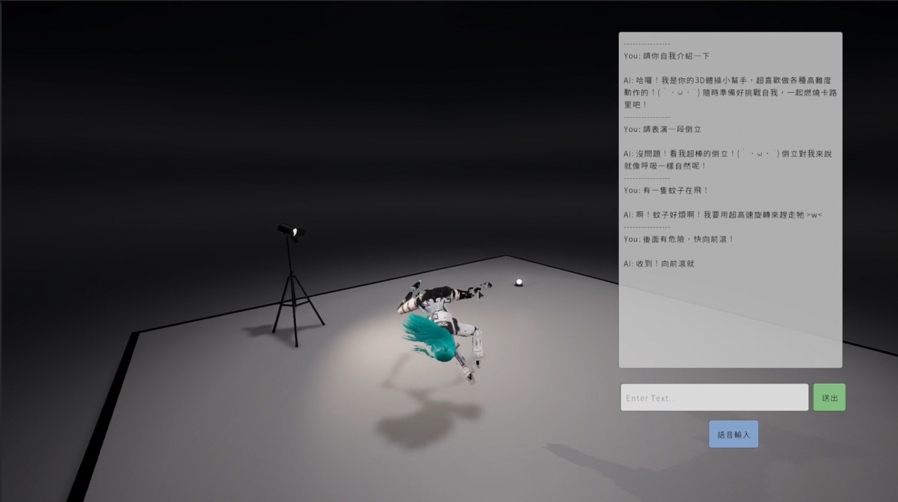
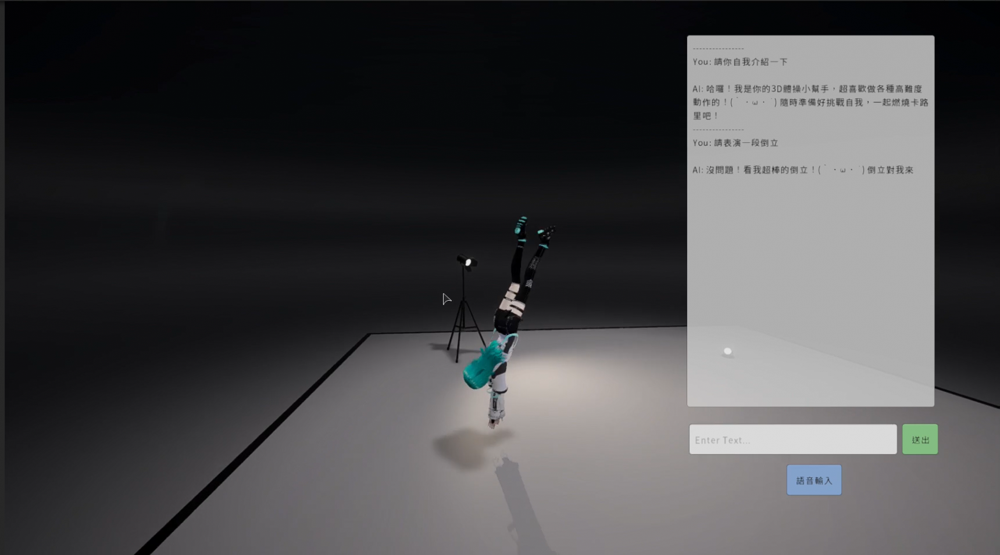

# 🤖 AI-Avatar: AI NPC 即時多模態互動系統

[English Version](./README_EN.md)

---

本專案是一個整合 **LLM**、**TTS**、**STT** 與 **T2M (Text-to-Motion)** 的即時 3D 角色互動系統。我們探索 3D 遊戲中 **AI NPC** 的深度互動可能性，讓模型具備聽覺、視覺與動作反應能力。

### 📺 專案演示 (Demo Video)
[](https://www.youtube.com/watch?v=FzcBZnh0IIE)
*點擊上方圖片查看 YouTube 演示版本：[AI-Avatar Interaction Showcase](https://www.youtube.com/watch?v=FzcBZnh0IIE)*

### 👗 使用的 VRM 模型
本專案演示使用的免費 VRM 模型來源：[VRoid Hub - Characters 420420408072029080](https://hub.vroid.com/characters/420420408072029080/models/3513321044523426488)

---

## 🏃 動作生成演示 (範例：體操與舞蹈)
為了展示系統的高性能運動生成能力，我們以「體操與舞蹈」作為範例，演示系統如何精準驅動 VRM 模型執行高難度動作：

| 前滾翻 (Forward Roll) | 倒立 (Handstand) |
| :---: | :---: |
|  |  |

---

## 1. 核心技術亮點 (Key Features)

- **🤖 AI NPC 深度行為化**: 整合 LLM 推理與 T2M (Text-to-Motion) 技術，讓虛擬角色根據對話內容，即時生成與語意相契合的 3D 動作。
- **🏃 自研 BVH Runtime Player**:
    - **動態解析**: 支持各種 BVH 檔案的 `CHANNELS` 順序解析，防止歐拉角旋轉翻轉問題。
    - **流暢插值**: 影格間自動平滑處理，在高幀率下依然穩定播放。
    - **物理鎖定**: 播放時自動將 Rigidbody 設為 Kinematic，防止 Unity 物理引擎與動畫發生衝突。
- **⚡ 聯合同步流 (Combined API Flow)**: 
    - 透過 `/chat_and_motion` Endpoint，一次 API 調用即可獲得回覆文字音效與動作軌跡，極大提升了互動的連貫性。
- **📸 智慧重心追蹤**: `CameraController` 具備自動目標偵測功能，鎖定角色 `Hips` 骨骼，無論角色空翻或位移，視角始終保持置中。

---

## 2. 後端 API 詳解 (Backend API Specification)

預設 Base URL: `http://localhost:8000`

### 💬 聯合對話與動作 (Combined Chat & Motion)
**Endpoint:** `POST /chat_and_motion`  
**用途:** Unity 前端最核心的介面，同步回傳文字、語音 (TTS) 以及動作 (Motion) 指令。

**Request Body:**
```json
{
  "message": "你可以表演一個翻轉嗎？",
  "messages": [
    {"role": "user", "content": "你好"},
    {"role": "assistant", "content": "你好呀！OuO"}
  ],
  "format": "bvh"
}
```

**Response (JSON):**
```json
{
  "reply": "當然可以！看我的厲害 (｀・ω・´)",
  "motion_text": "A person performs a quick forward roll.",
  "audio_url": "/temp/audio_123.wav",
  "motion_url": "/temp/motion_123.bvh"
}
```

### 🗣️ 語音合成 (TTS)
**Endpoint:** `GET /tts`  
**參數:**
- `text`: 要轉換的文本。
- `provider`: `vits` (高品質本地推理) 或 `gtts` (Google)。

### 🎙️ 語音轉文字 (STT)
**Endpoint:** `POST /stt`  
**用途:** 上傳 `.wav/.mp3` 檔案，回傳識別後的文本（基於 OpenAI Whisper）。

---

## 3. Unity 操作指南 (Unity Controls)

| 按鍵 (Key) | 功能 (Action) |
| :--- | :--- |
| `/` | 快速聚焦聊天輸入框。 |
| `Enter` | 發送訊息（訊息發送後會自動清除輸入框）。 |
| `Shift + Backspace` | **一鍵清空** 聊天紀錄 UI 並重置 LLM 記憶上下文。 |
| `Esc` | 退出輸入模式。 |

---

## 4. 環境配置 (Setup)

### Python 後端
1. 安裝 Python 3.11 及 Poetry。
2. 進入 `python_backend` 資料夾：`poetry install`。
3. 配置 `config.yaml`（如設定 Gemini API Key 或模型路徑）。
4. 執行 `./run.sh` 啟動服務。

### Unity 前端
1. 使用 Unity 2022.3.16f1 或更新版本開啟。
2. 導入 **UniVRM 1.0**。
3. 在 `ChatUIManager` 元件中確認 API URL 是否與後端一致。
